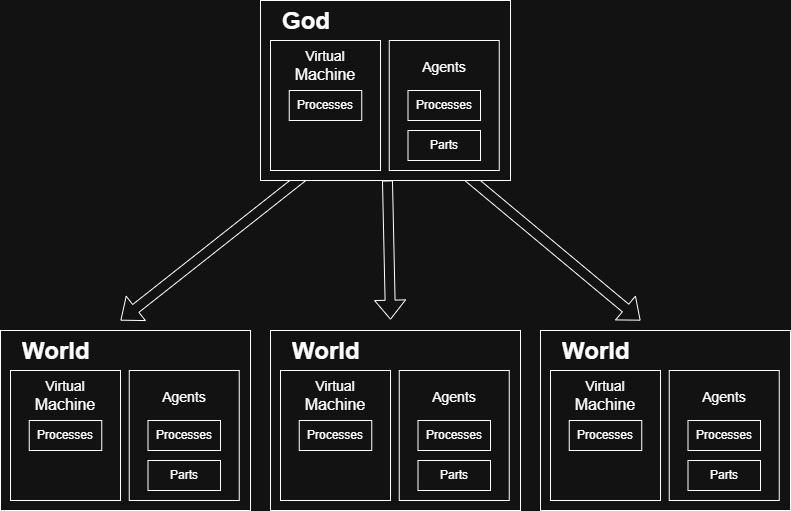

# shhArc
SCRIPTED AGENT ENGINE

  
<h2>Overview</h2>
The shhArc agent system is based upon the Lua scripting language. The Lua reference manual is available 
<a href="http://www.lua.org/manual/5.4/">here</a>.  
The shhArc engine supports multiple simulated worlds. 
In order to do this it has a God object that manages the worlds. 
The God object has its own agent system that can be used for world managing agents or even user interface agents within a game. 
It also has a virtual machine used for booting the engine, creating the worlds and manipulating them. 
Each world has its own agent system and virtual machine. Agents in different worlds do not know about each other unless informed by God vm/agents.
An agent can have sub processes and these can either be used to execute scripts or as Nodes belonging to the agent.
Agents can communicate with each other via a sandboxed messageing system. Agents also contain Parts which are simply smart pointers to any in engine object you wish an agent to have.
The engine is written is C++ and is designed to be extensible so you can easily add your own data types to be used in scripts and also
your own C function that can be called from script. So you can implement add functions that can be called from script to create and manipluate Parts within an agent. 
  
Nodes are processes within an agent and like agents have their own script. They can also comunicate with each other via the sandboxed messaging system but only with other nodes within the same agent and to their owning agent. Nodes also have input and output interfaces which can be connected to those in other nodes via edges to facilitate fast transfer of information The engine uses schema files which are in the JSON format and
are used to quickly construct networks of different types of nodes with an agent.  
The scripting documentation and be found  <a href="https://github.com/shhArc/shhArc/blob/main/Docs/ScriptingManual/">here</a>.
   

   
<h2>Installation Nodes</h2>
Clone this shhArc repo and the shhThirdParty repo found <a href="https://github.com/shhArc/shhThirdParty">here</a>.
   
Set the following environment variables:  
SHH_ENGINE = YOURPATH\shhArc\Code 
SHH_GCPTR = YOURPATH\shhArc\Code\GCPtr\ 
SHH_MEMORYMANAGEMENT = YOURPATH\shhArc\Code\MemoryManagement\ 
SHH_THIRDPARY = YOURPATH\shhThirdParty\ 
  
Load the demo Visual Studion project: YOURPATH\shhArc\Code\DemoApp\Win64\DemoApp.sln  
Set the runtime directory to: YOURPATH\shhArc\Code\DemoApp\Runtime  
Build, run & enjoy.
   
<h2>Licence</h2>
shhArc is available under the MIT License with a No Modification clause. Except for the files in Code/Config which do not have the No Modification Clause, as you need to edit these to configure shhArc as you want it.
   
<h2>Release Notes</h2>
Current version is Alpha 0.001.  
Outstanding features to come: 
Multi Threading 
Persistance 
<!--
**shhArc/shhArc** is a ✨ _special_ ✨ repository because its `README.md` (this file) appears on your GitHub profile.

Here are some ideas to get you started:

- 🔭 I’m currently working on ...
- 🌱 I’m currently learning ...
- 👯 I’m looking to collaborate on ...
- 🤔 I’m looking for help with ...
- 💬 Ask me about ...
- 📫 How to reach me: ...
- 😄 Pronouns: ...
- ⚡ Fun fact: ...
-->
